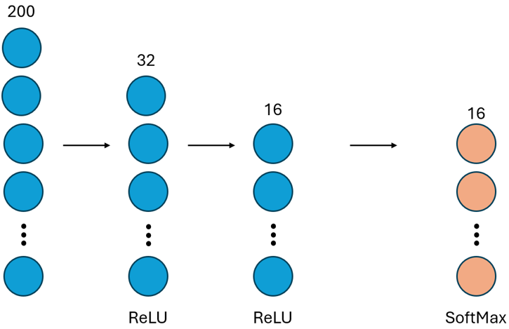
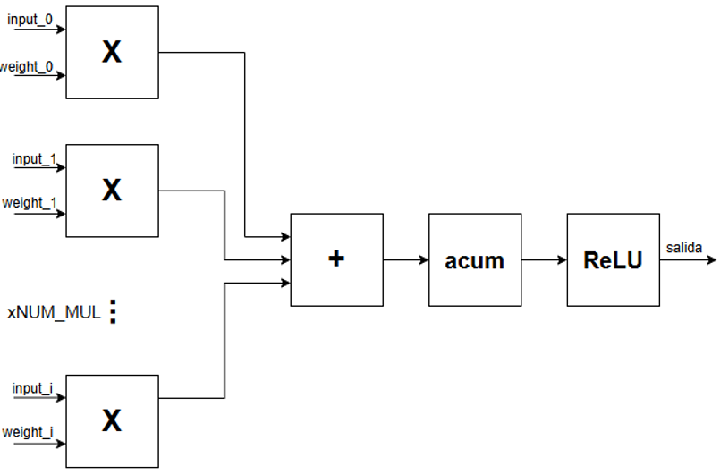
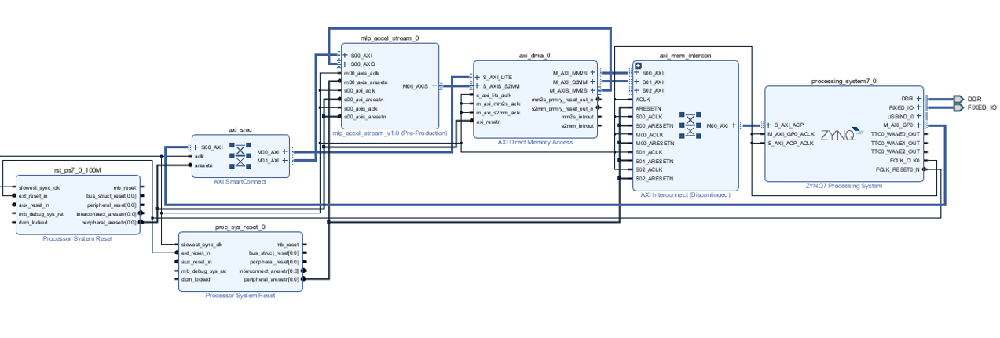
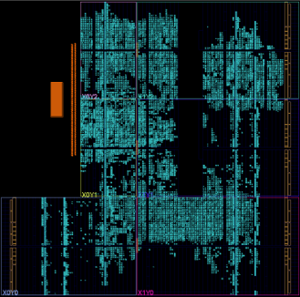

# FPGA-Accelerated MLP for Hyperspectral Image Classification

A Zynq-7000 hardware accelerator for neural network inference - and a study of why **data movement, not compute, is the real bottleneck** in small embedded systems.

This project offloads a fully-connected neural network from an ARM Cortex-A9 to custom programmable logic on a ZedBoard, achieving a **~20× latency speedup** and **~17× lower energy per inference**. More interestingly, it shows that once the compute is fast enough, the entire performance story collapses onto a single dimension: how data gets in and out of the accelerator.

---

## Key finding

On a small embedded SoC, accelerating the *computation* is the easy part. The hard limit is **communication** between the processor and the accelerator.

The evidence is in the progression:

- Moving the same compute core from per-word `AXI-Lite` transfers to `DMA + AXI-Stream` improved latency by **5×** - without touching the math.
- Once on DMA, *doubling the memory bus width to 64 bits produced almost no improvement* (5.79 → 5.76 µs). The compute and the bus were no longer the bottleneck; the fixed DMA setup overhead was.

This is the central intellectual result of the project: in this class of system, the communication architecture is the design dimension that matters most.

---

## Results

The target to beat: the same model running on the ARM Cortex-A9 @ 666 MHz, compiled with `-O2`.

| Configuration | Latency | Speedup vs ARM | Notes |
|---|---|---|---|
| **ARM baseline** (Cortex-A9 @ 666 MHz) | 120 µs | 1× | software reference |
| AXI-Lite (per-word transfer) | 31 µs | 3.85× | bottlenecked by communication |
| DMA + AXI-Stream | 6.26 µs | 19.2× | no per-word overhead |
| + more parallelism (`NUM_MUL=5`) | 5.79 µs | 20.7× | layer-0 cycles 100 → 40 |
| + 64-bit memory bus | 5.76 µs | 20.8× | negligible gain → bus is not the limit |

### Energy

Energy efficiency matters as much as latency in embedded systems. Energy per inference is **power × time**:

| | Power (used in calc.) | Time | Energy per inference |
|---|---|---|---|
| ARM (software) | ~1.68 W (ARM under load) | 120 µs | ~202 µJ |
| FPGA accelerator | 2.068 W (total on-chip) | 5.76 µs | ~12 µJ |

**~17× less energy per inference** (202 / 12).

A few honest caveats on these figures:

- The hardware power is the **total on-chip** figure reported by Vivado (2.068 W: dynamic + static), not just the accelerator's own 0.384 W — the ARM stays powered during PL compute, so it must be counted.
- The ARM software power (~1.68 W) is an **estimate** of the PS7 under computational load, not a direct measurement; the report's idle PS7 figure is ~1.531 W. The order of magnitude of the result is robust to this estimate, since the ~21× shorter runtime dominates.
---

## The model

A multilayer perceptron classifying pixels of the **Indian Pines** hyperspectral dataset (16 land-cover classes), with 200 spectral bands per input.

```
200 → 32 (ReLU) → 16 (ReLU) → 16 (SoftMax)
```



The model is trained in floating point and quantized to **Q8.8 fixed point** for hardware. Quantization preserves accuracy almost exactly: **82.85%** (Q8.8) vs **82.71%** (float32). All inference runs entirely in the programmable logic; the ARM only feeds inputs and collects results.

---

## Hardware architecture

The compute core is a parametric MAC datapath. Each neuron multiplies `NUM_MUL` input/weight pairs per cycle, sums them in an adder tree, accumulates in Q8.8, and applies ReLU (except on the output layer):



Two generics drive the whole design:

- **`NUM_MUL`** - multiplications per neuron per cycle. Higher means fewer cycles, but a longer combinational path.
- **`NUM_CICLOS`** - cycles per layer, derived from the input count and `NUM_MUL`.

The PL runs at **100 MHz**. The full system wires the custom MLP IP to the ARM via a DMA engine and AXI interconnect:



From left to right: the **MLP accelerator IP** receives the input stream and exposes a control/status register bank over AXI-Lite; the **AXI DMA** moves data between DDR and the accelerator without per-word CPU involvement; the **Zynq PS** (ARM + DDR) issues a single transfer command and reads back the result.

### Data flow (DMA path)

The ARM prepares 200 values in DDR, configures the receive channel, and launches the transfer. The DMA streams 100 words of 32 bits to the accelerator; the IP computes and returns 8 words of 32 bits. One subtlety that cost real debugging time: **cache coherency**. The DMA does not see the ARM's cache, so the transmit buffer must be flushed (`Xil_DCacheFlushRange`) and the receive buffer invalidated (`Xil_DCacheInvalidateRange`) around each transfer.

---

## Resources and the parallelism / timing trade-off

Utilization on the `xc7z020`:

| Resource | Used | Available | % |
|---|---|---|---|
| DSP | 200 | 220 | **91%** |
| LUT | 17,358 | 53,200 | 33% |
| FF | 12,026 | 106,400 | 11% |
| BRAM | 3 | 140 | 2% |



The DSPs are the binding constraint at **91%**. This is what limits how far `NUM_MUL` can scale on this device, and it surfaces directly in timing closure:

| | `NUM_MUL = 2` | `NUM_MUL = 5` |
|---|---|---|
| Worst Negative Slack (WNS) | **+0.080 ns** | −5.266 ns |
| Failing endpoints | 0 | 9,814 |
| Timing met? | **Yes** | No |

This is a deliberate design decision rather than a flaw:

- **`NUM_MUL = 2`** is the **deployable** configuration - it closes timing at 100 MHz on the `xc7z020` and is what actually runs on hardware.
- **`NUM_MUL = 5`** represents the **theoretical performance ceiling** of the parametric design. It does not close timing on this device because the combinational MAC path becomes too long for a 100 MHz period and the DSPs are nearly exhausted. On a larger FPGA (or with a pipelined neuron) that ceiling becomes reachable.

In other words, the design already expresses the faster configuration; the current chip is what holds it back. Raising that ceiling is concrete future work (see below).

---

## Repository structure

| Path | Contents | 
|---|---|
| `rtl/core/` | The compute core: `neurona`, `capa`, `top`, `counter`, `reg_32`, `weights_pkg` | 
| `rtl/axi/` | AXI wrappers for the streaming IP - input packing, output mux, cycle counter, DMA init FSM | 
| `rtl/axilite_baseline/` | The earlier AXI-Lite version of the accelerator (the starting point of the story) | 
| `sim/` | Testbenches: `tb_top.vhd`, `test_pkg.vhd`, `mlp_accel_stream_tb.sv` | 
| `sw/baremetal/` | Bare-metal ARM C: `mlp_stream.c` (DMA path), `mlp_axilite.c` (baseline), `forward.*` (reference inference), `pmu.*` (cycle counting) | 
| `sw/scripts/` | Python generators for weights and test vectors (`gen_weights_*`, `gen_test_*`, `quan_test`) | 
| `ip/` | Tcl scripts to package/regenerate the custom IP | 
| `docs/images/` | Diagrams | 


---

## Build and reproduce

**Tools:** Vivado 2025.2 and Vitis 2025.2 (AMD/Xilinx), on Windows.
**Target:** ZedBoard (Zynq-7000, `xc7z020`).

This repository contains *sources*, not the full Vivado/Vitis project trees (those are large, tool-generated, and regenerable). To rebuild:

1. **Generate weights and test vectors.** Run the Python scripts in `sw/scripts/` to produce `weights_pkg.vhd` (for RTL) and `weights.h` / `test.h` (for the ARM software). The weights file in `rtl/core/` is one such generated artifact.
2. **Package the IP.** Use the Tcl in `ip/` to repackage the custom accelerator IP into a local IP repository. *Tip: if a repackage seems to use stale logic, reset the out-of-context (OOC) synthesis runs - cached checkpoints can hold an old version of the IP.*
3. **Build the block design** in Vivado: Zynq PS7 + the MLP IP + AXI DMA + interconnect, PL clock at 100 MHz. Synthesize, implement, generate the bitstream.
4. **Export the XSA**, then build the Vitis platform and the bare-metal application from `sw/baremetal/`.

### Platform notes (learned the hard way)

- The processor init file (`ps7_init.tcl`) must come from the **Vitis platform** (regenerated after XSA export), not from Vivado's IP directory.
- Around every DMA transfer, **flush** the TX buffer and **invalidate** the RX buffer to maintain cache coherency.
- Synthesis takes ~40 minutes per iteration; plan experiments accordingly.

---

## Future work

- **Pipeline the neuron.** Splitting the MAC into `multiply → [register] → sum + accumulate → [register]` shortens the critical path, letting higher `NUM_MUL` close timing at the cost of +1 cycle of latency per layer.
- **Target a larger FPGA** to lift the DSP ceiling and realize the `NUM_MUL=5` performance.
- **Suspend the ARM during PL compute** for additional energy savings.
- **Scale to larger models**, where the hardware advantage grows.


---

*Javier Salafranca Pradilla · 2026*
